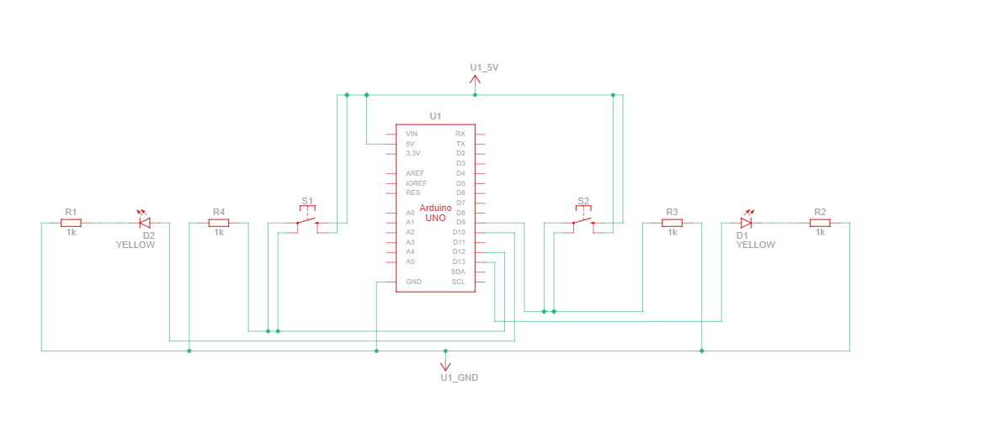

# Vehicle Indicator Control System

This is a bare metal embedded software project for controlling vehicle indicators/turn signals.

This project implements a simple vehicle indicator control system using Arduino hardware. It provides basic turn signal functionality without using the Arduino framework, working directly with the microcontroller registers.



## Features

- Left and right turn signal control
- Hazard warning lights
- LED status indication
- Bare metal implementation (using ***avr gcc*** Library)

## Building

The project uses AVR-GCC toolchain and avrdude for uploading.

```bash
make compilefull    # Compile the project
make upload         # Flash to Arduino
```

## Hardware Requirements

- Arduino board (e.g., Arduino Uno, Nano)
- LEDs for indicators
- Push buttons for control
- Appropriate resistors

## Setup

1. Connect LEDs to designated output pins
2. Connect control buttons to input pins
3. Upload the compiled binary to the Arduino board
